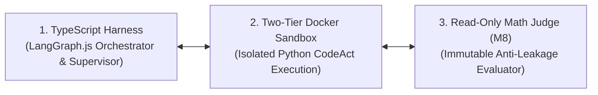
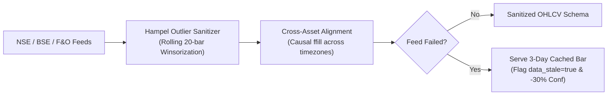
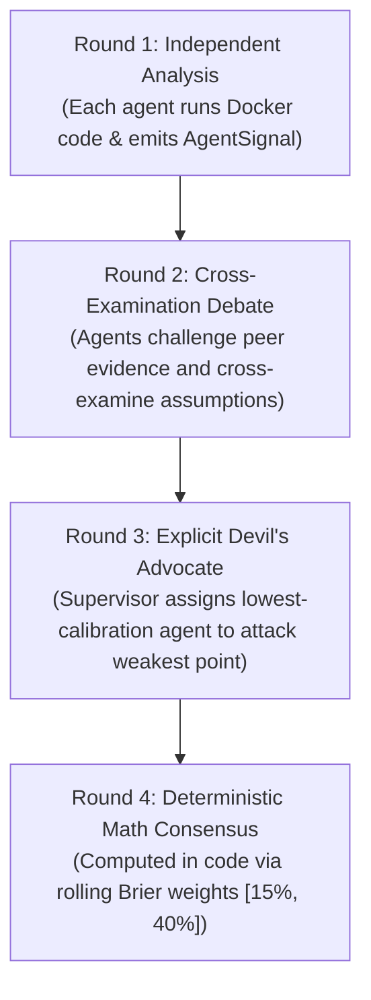
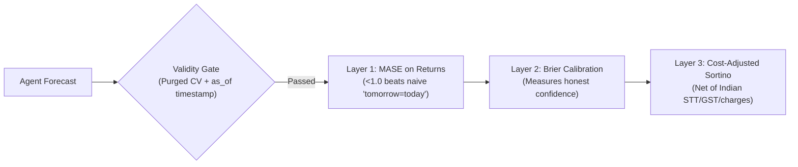
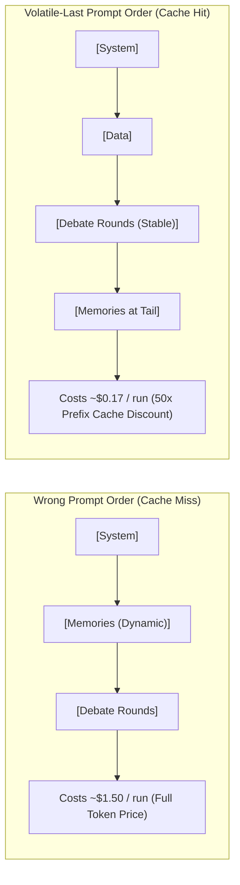

# Forecasting Agent — Architecture Explainer Pitch Deck
> **Your spoken walkthrough script to present the full architecture effortlessly to any engineer, architect, or investor.**

---

## 🎙️ Slide 1: The 10-Second Hook

```
┌────────────────────────────────────────────────────────────────────────────────────────┐
│ "Think Claude Code, but for financial and market analysis.                            │
│  Instead of chatting, our agents write and execute real Python code in Docker,         │
│  debate each other across 4 adversarial rounds, and grade themselves with pure math."  │
└────────────────────────────────────────────────────────────────────────────────────────┘
```

### 🗣️ What to Say:
> *"Most financial AI tools are text-in, text-out chatbots that hallucinate numbers. We built a software engineer for forecasting: an agent that pulls live market data, writes quantitative Python scripts to test hypotheses, runs them in sandboxes, and resolves disagreements using mathematical calibration."*

---

## 🏛️ Slide 2: The 3 Core Architectural Pillars



### 🗣️ What to Say:
> *"Our architecture separates three distinct concerns:*
> 1. **The Brain (TypeScript):** Orchestrates multi-agent planning and tools using LangGraph.js.
> 2. **The Workbench (Docker):** Safely executes agent-generated Python modeling scripts in isolated containers.
> 3. **The Judge (Read-Only Python):** Evaluates models against strict time-series metrics. The agent can never edit or cheat its own grader.*"

---

## 📊 Slide 3: The Data Layer (M1) & Resilience



### 🗣️ What to Say:
> *"Market data is messy and prone to scrapers breaking. M1 solves this in two ways:*
> - **Deterministic Cleaning:** It runs rolling Hampel filters to clip rogue fat-tail outliers and aligns holidays across US, Indian, and crypto markets.
> - **Graceful Degradation:** If live exchange scrapers fail, M1 serves yesterday's cached data, marks `data_stale=true`, and automatically penalizes the agent's confidence by 30% rather than crashing.*"

---

## 👥 Slide 4: Participant-Intent Modeling (M6)

```
┌────────────────────────────────────────────────────────────────────────────────────────┐
│ PRICE AGENT (Anchor) ──► Baseline Technical Indicators, EMA Trends, & Volatility Bands │
├────────────────────────────────────────────────────────────────────────────────────────┤
│ FII INTENT AGENT     ──► Foreign Institutional Flows, Index F&O OI, & Global Cues      │
├────────────────────────────────────────────────────────────────────────────────────────┤
│ DII INTENT AGENT     ──► Domestic Mutual Fund Flows, Systematic Investment (SIP) Trends│
├────────────────────────────────────────────────────────────────────────────────────────┤
│ RETAIL INTENT AGENT  ──► Client F&O Positioning, Bhavcopy Delivery % & News Catalysts │
└────────────────────────────────────────────────────────────────────────────────────────┘
```

### 🗣️ What to Say:
> *"Instead of generic AI analysts looking at the same price chart, we model **market participant intent** using India's unique NSE disclosures. One agent models foreign institutional flows, another models domestic mutual funds, another models retail derivative positioning, and the fourth serves as a technical price baseline.*
>
> *Each agent autonomously writes Python scripts in `workspace/code/features/` to compute rolling cross-correlations and flow ratios.*"

---

## 🥊 Slide 5: The 4-Round Adversarial Debate (M7)



### 🗣️ What to Say:
> *"LLMs suffer from sycophancy—they tend to agree with each other 85% of the time. We break echo chambers with a 4-round protocol:*
> - **R1:** Agents analyze data independently in Docker.
> - **R2:** Agents cross-examine each other's evidence.
> - **R3 (Devil's Advocate):** The supervisor finds the weakest argument and forces the lowest-calibration agent to aggressively attack it.
> - **R4 (Arithmetic Consensus):** The final probability is **computed in code** using historical accuracy weights. The LLM only writes the narrative; it never touches the final numbers.*"

---

## 🛡️ Slide 6: Two-Tier Sandboxing & Execution (M5)

```
  TIER 1: EXPLORE (Fast & Stateful)              TIER 2: VALIDATE (Cold & Clean)
┌────────────────────────────────────────┐     ┌────────────────────────────────────────┐
│ • Warm, persistent Docker container    │     │ • Fresh cold-start container           │
│ • PyPI package installs allowed        │ ──► │ • Zero network access (--network none) │
│ • 45s hard timeout & max 5 retries     │     │ • Standard pre-baked image only        │
│ • Async Semaphore(2) limits concurrency│     │ • M8 Evaluator mounted strictly ro     │
└────────────────────────────────────────┘     └────────────────────────────────────────┘
```

### 🗣️ What to Say:
> *"Running AI-generated code has two conflicting needs: exploration needs to be fast and allow experimenting with libraries, but validation must be 100% clean and reproducible.*
>
> *Under our two-tier design, the agent iterates freely in a warm scratchpad. When it submits a model, we re-run it from scratch on a clean container with zero internet. If it fails there, it depended on leftover residue and gets rejected immediately.*"

---

## ⚖️ Slide 7: The Read-Only Evaluator (M8) & Anti-Leakage



### 🗣️ What to Say:
> *"The biggest failure mode in financial machine learning is backtest leakage—looking into the future. We solve this structurally:*
> 1. **Read-Only Scorer:** `core/evaluation/` is mounted read-only. The agent cannot modify the metrics.
> 2. **Temporal `as_of` Guard:** Every memory and data row is stamped with an `as_of` date. When backtesting on March 2025, the system physically cannot query memories from June 2025.
> 3. **MASE on Returns:** We evaluate returns relative to a naive baseline. Predicting 'tomorrow = today' gets zero score.*"

---

## 💰 Slide 8: The $0.17 Unit Economics Secret (M2 / M9)



### 🗣️ What to Say:
> *"DeepSeek offers a 31–50x discount for tokens it has already seen, but only if the prompt prefix is 100% byte-stable.*
>
> *We engineered **Volatile-Last Context Assembly**: stable system prompts and debate history sit at the front, while changing memory retrievals sit at the very tail. This single architectural decision cuts our cost per forecast from $1.50 down to **$0.17**, giving us **85% gross margins**.*"

---

## 🔍 Slide 9: Observability, Tracing & Fail-Fast Boot (ADR-026/027)

```
┌────────────────────────────────────────────────────────────────────────────────────────┐
│ 1. UUIDv7 Correlation ID: Links LangGraph spans, Docker tracebacks, and DB records.    │
├────────────────────────────────────────────────────────────────────────────────────────┤
│ 2. Deterministic Audit Log: Postgres `debate_traces` table stores every raw prompt.    │
├────────────────────────────────────────────────────────────────────────────────────────┤
│ 3. 200ms Boot Handshake: Pings Postgres, Docker, and scrapers before spending tokens. │
└────────────────────────────────────────────────────────────────────────────────────────┘
```

### 🗣️ What to Say:
> *"We built institutional-grade observability into the system:*
> - **Unified Trace Hierarchy:** Every LLM token, Docker traceback, and MCP call is tied to a single root `forecast_run_id` across TypeScript and Python.
> - **200ms Fail-Fast Boot Check:** When the CLI starts, it verifies Docker, Redis, Postgres, and MCP connections in 200 milliseconds. If an API key is missing or Docker is offline, it tells you immediately before wasting a token.*"

---

## 🎯 Slide 10: The Executive Summary (The Bottom Line)

```
┌────────────────────────────────────────────────────────────────────────────────────────┐
│                                 THE 5-STEP LIFECYCLE                                   │
│                                                                                        │
│  [1. Clean Data] ──► [2. 4-Way Debate] ──► [3. Sandboxed Python Code]                 │
│                                                   │                                    │
│                                                   ▼                                    │
│  [5. 1-Page Digest Card] ◄── [4. Read-Only Math & Anti-Leakage Scoring]                │
└────────────────────────────────────────────────────────────────────────────────────────┘
```

### 🗣️ Your Closing Words:
> *"In summary, this is not a wrapper. It is an end-to-end, sandboxed, mathematically verifiable intelligence engine:*
> - *It writes real code instead of chatting.*
> - *It argues from real exchange flow data instead of noise.*
> - *It cannot cheat its own evaluation.*
> - *And it runs for less than 20 cents a forecast with 85% gross margins.*
>
> *That is the Forecasting Agent architecture.*"
