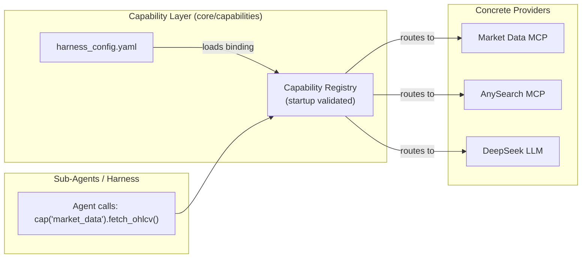
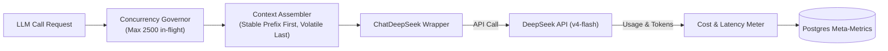
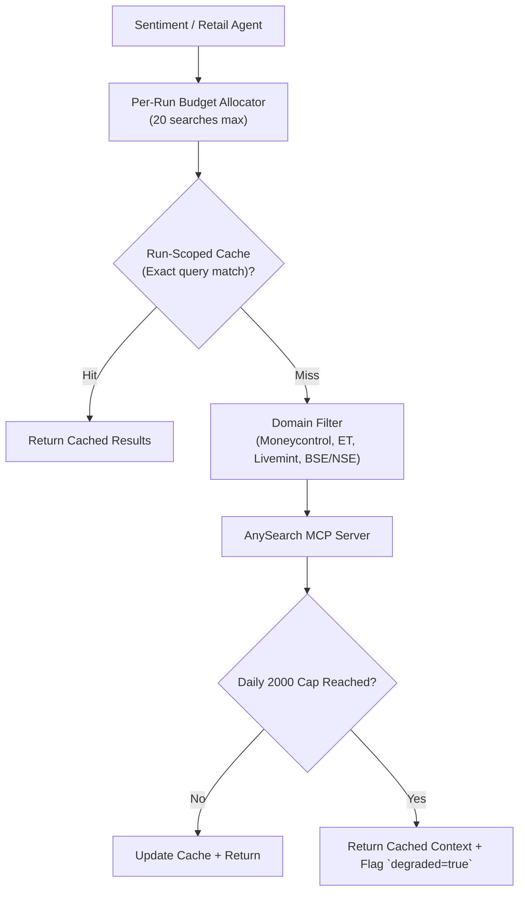
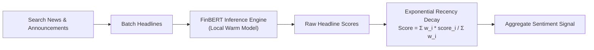
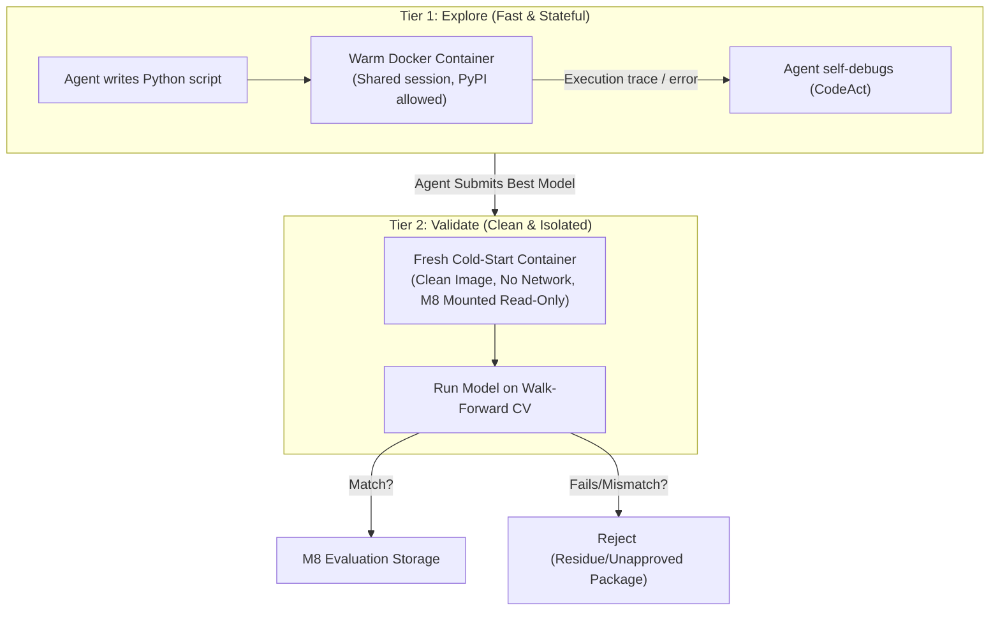
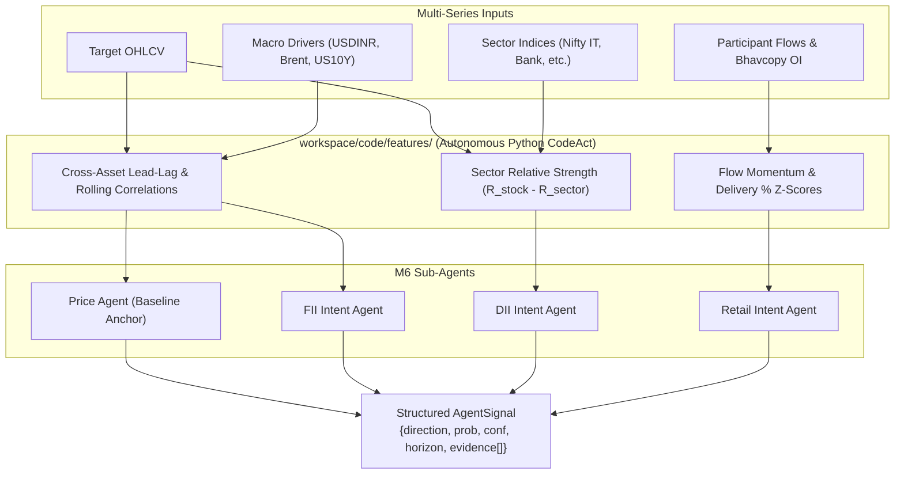
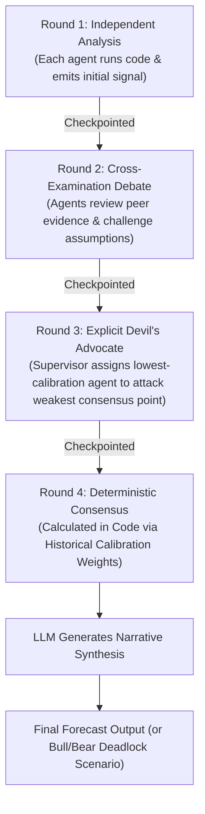
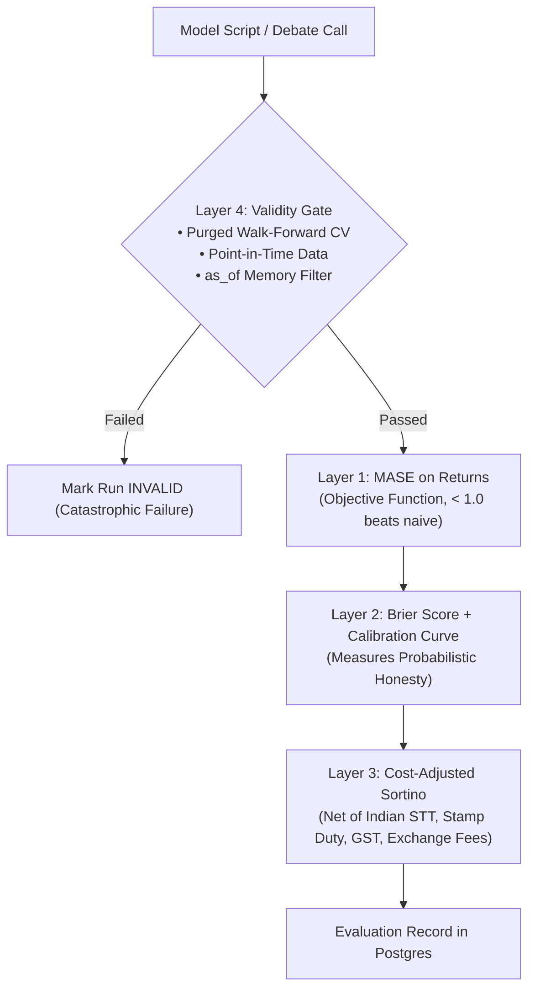
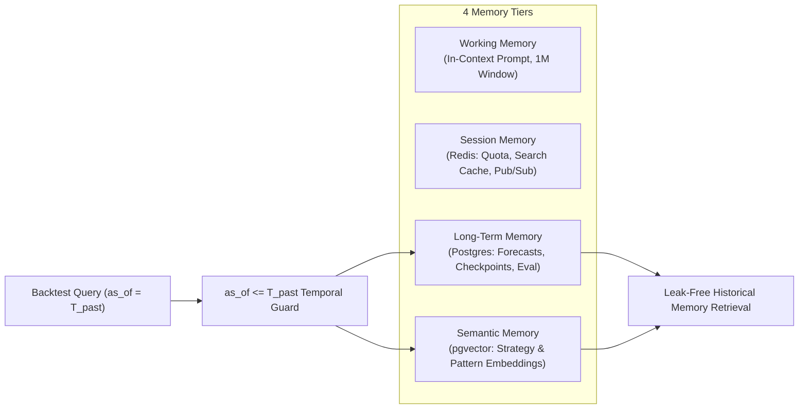

# Module Architecture Specifications (M1–M11)

Comprehensive visual and structural blueprints for all 11 modules in the Forecasting Agent platform.

## 1. Capability Layer (CAP) — ADR-015
- **Pattern:** Micro-Kernel / Dependency Inversion / Registry Pattern
- **Responsibility:** Maps abstract capabilities (`search`, `market_data`, `sentiment`, `chat`) to concrete MCP servers or LLM providers. Agent code never imports or names a vendor.



## 2. M1: Market Data MCP Server — ADR-006, ADR-013, ADR-025
- **Pattern:** Ports & Adapters (Hexagonal) / Plugin Registry / Deterministic Sanitizer
- **Responsibility:** Standardizes market feeds (NSE, BSE, US, Crypto, F&O) into strict OHLCV schemas. Handles outlier sanitization (Hampel filter/Winsorization), calendar alignment across cross-assets, corporate action adjustments, caching, and point-in-time filtering.

```mermaid
flowchart TB
    MCP["MCP Client (Harness / Sandbox)"]

    subgraph M1["M1: Market Data Server (Python MCP)"]
        SRV["server.py (MCP Tool Surface)"]
        REG["registry.py (Manifest Loader)"]
        CACHE["cache.py (Parquet / Redis)"]
        CLEAN["cleaner.py (Outlier Hampel Filter & Circuit Flags)"]
        NORM["normalizer.py (Multi-Asset Calendar Alignment)"]
        PIT["point_in_time.py (Date Filter)"]

        subgraph Plugins["Market Plugins (contracts.py compliant)"]
            PL_NSE["nse.py"]
            PL_US["us_stocks.py"]
            PL_FNO["fno.py"]
            PL_CRYPTO["crypto.py"]
        end
    end

    MCP -->|fetch_ohlcv(symbol, range)| SRV
    SRV --> REG
    REG --> CACHE
    CACHE -->|cache miss| Plugins
    Plugins -->|yfinance / CSV feed| CLEAN
    CLEAN --> NORM
    NORM --> PIT
    PIT -->|validated OHLCV schema| SRV
```

## 3. M2: LLM Client & Governor — ADR-009, ADR-014, ADR-016
- **Pattern:** Gateway / Leaky Bucket Concurrency Governor / Checkpoint-Resume
- **Responsibility:** Handles token metering, exponential backoff, prefix-stable prompt assembly, and off-peak scheduling for DeepSeek.



## 4. M3: News & Web Search MCP — ADR-010, ADR-017
- **Pattern:** Run-Scoped Cache / Token Bucket Rate Limiter / Graceful Degrader
- **Responsibility:** Allocates 20 searches per forecast run; enforces domain allowlisting on Indian business media; protects against blowing the 2,000/day quota.



## 5. M4: Sentiment Engine MCP — ADR-018
- **Pattern:** Specialist Microservice / Exponential Recency Decay Aggregator
- **Responsibility:** Scores financial headlines, applies exponential time decay, and aggregates news into a normalized sentiment vector.



## 6. M5: Two-Tier Code Execution Sandbox — ADR-021
- **Pattern:** Two-Tier Sandboxing (Warm Stateful Scratchpad vs. Cold Clean Validator)
- **Responsibility:** Executes agent-written Python modeling code safely while guaranteeing no hidden state or unapproved packages pollute final evaluation.



## 7. M6: Agent Layer & Multi-Series Features — ADR-023, ADR-025
- **Pattern:** Specialist Worker Sub-agents / Autonomous Feature Engineering / Participant-Intent Modeling
- **Responsibility:** 4 sub-agents write autonomous multi-series Python feature engineering scripts (`workspace/code/features/`) and model participant actions. Emits structured `AgentSignal`.



## 8. M7: Orchestrator & 4-Round Debate — ADR-003, ADR-022, ADR-024
- **Pattern:** Supervisor / 4-Round StateGraph / Hard Adversarial Assignment / Code Aggregation
- **Responsibility:** Coordinates multi-agent rounds; assigns Devil's Advocate to lowest-calibration agent; computes consensus arithmetically in code.



## 9. M8: Read-Only Evaluation Engine — ADR-011, ADR-012
- **Pattern:** Immutable Oracle / 4-Layer Metric Pipeline / Walk-Forward Gate
- **Responsibility:** Scores models and debate calls; acts as an isolated platform judge that the agent cannot modify or game.



## 10. M9: Storage & 4-Tier Memory — ADR-020
- **Pattern:** Tiered Memory Architecture / Temporal Point-in-Time Indexing
- **Responsibility:** Prevents memory leakage into past backtests with mandatory `as_of` timestamping.



## 11. M10 & M11: Delivery Interface & Skill Registry
- **Pattern:** Event-Driven SSE / Repository Pattern / Off-Peak Cron Scheduler
- **Responsibility:** M10 streams live debate progress to CLI/React UI; M11 persists high-scoring models and skills for future forecast runs.

```mermaid
flowchart LR
    SCHED["Cron Scheduler / CLI Request"] --> M7["Orchestrator (M7)"]
    M7 -->|Pub/Sub Events| REDIS["Redis Channel"]
    REDIS -->|Server-Sent Events (SSE)| UI["React UI / Terminal CLI"]
    M8["M8 Validated High-MASE Model"] -->|Auto-Save| SKILLS["Skill Registry (workspace/skills/)"]
    SKILLS -->|Loaded by| AGENTS["Future Agent Runs"]
```
