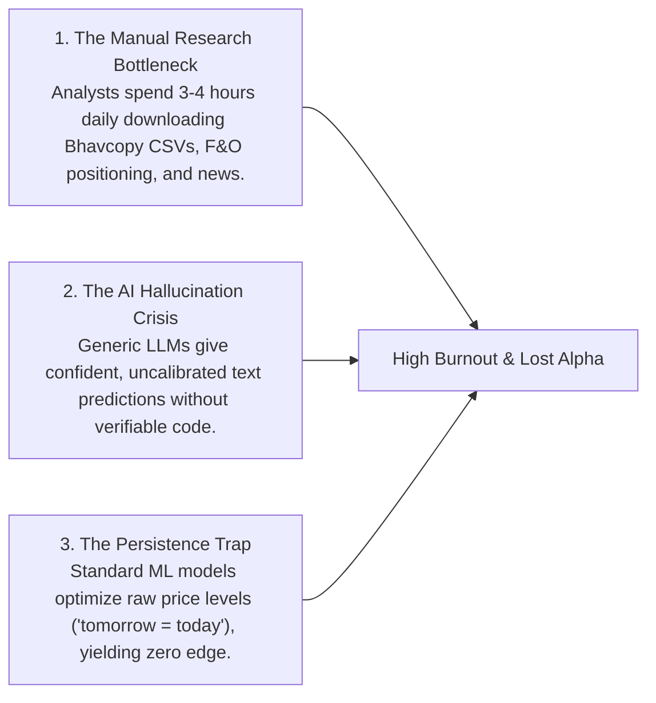
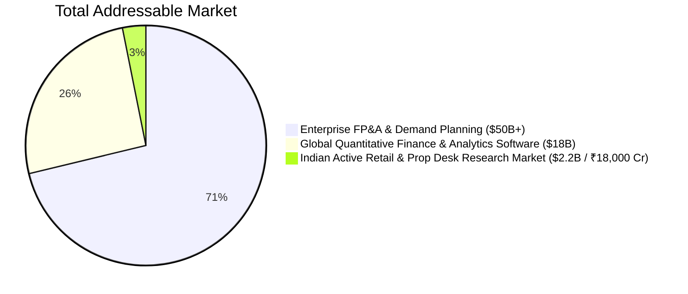
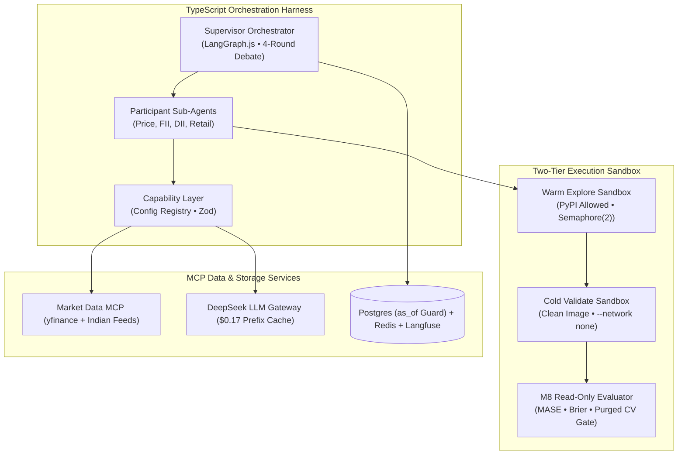
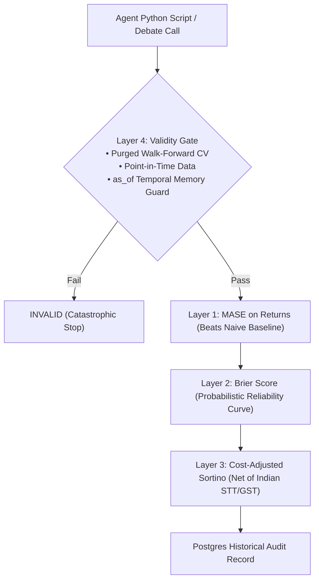
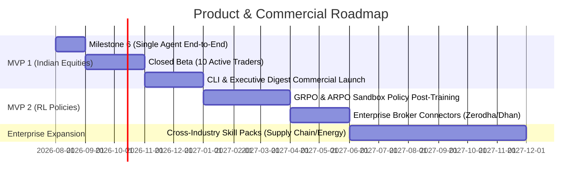

# Forecasting Agent — Pitch Deck

```
┌────────────────────────────────────────────────────────────────────────────────────────┐
│                                   FORECASTING AGENT                                    │
│                       Claude Code for Industry & Market Analysis                       │
│                                                                                        │
│         Autonomous Code-Writing Multi-Agent Platform with Mathematical Verification    │
└────────────────────────────────────────────────────────────────────────────────────────┘
```

---

## Slide 1: Executive Summary & Vision

> **"Financial and industry forecasting is broken: humans waste 3 hours a day compiling data, while generic AI hallucinates unverified numbers. We built an autonomous coding agent that writes, sandboxes, and verifies quantitative models on demand."**

- **The Vision:** A self-extending platform where financial forecasting is Skill Pack #1, expanding into a universal autonomous industry intelligence engine.
- **Core Edge:** Models Indian market participant intent (FII, DII, Retail) using proprietary exchange disclosures, audited by a read-only mathematical evaluation engine.
- **Unit Economics:** Sub-$0.20 cost per forecast ($0.17/run) delivering institutional-grade research with **85% software gross margins**.

---

## Slide 2: The Problem



- **Discretionary Traders:** Drowning in noisy retail social media tips and delayed newsletters.
- **Research Desks & Quants:** Trapped writing repetitive feature engineering boilerplate and wrestling with lookahead data leakage in backtests.

---

## Slide 3: The Solution

### An Autonomous Coding Analyst with Mathematical Verification

```
  TRADITIONAL BLACK-BOX AI                     FORECASTING AGENT
┌──────────────────────────────┐            ┌──────────────────────────────────────────────┐
│ • Prompts ChatGPT for advice │            │ • Writes executable Python scripts in Docker │
│ • No code execution          │   VS       │ • 4-round adversarial participant debate     │
│ • Uncalibrated conviction    │            │ • Arithmetic consensus weighted by accuracy  │
│ • Silent backtest leakage    │            │ • Read-only evaluation gate (zero leakage)   │
└──────────────────────────────┘            └──────────────────────────────────────────────┘
```

1. **Autonomous CodeAct Execution:** The agent doesn't just talk—it writes feature engineering and statistical modeling code in isolated Docker sandboxes.
2. **Deterministic Arithmetic Consensus:** LLMs argue in a 4-round debate, but final probability aggregation is pure arithmetic weighted by historical calibration (eliminating sycophancy).
3. **1-Page Actionable Executive Digest:** Delivers clear directional bias, participant positioning breakdown, bull/bear pathways, and thesis invalidation levels.

---

## Slide 4: Market Opportunity (TAM / SAM / SOM)



- **TAM ($50B+):** Global enterprise forecasting, FP&A, and supply-chain predictive analytics.
- **SAM ($2.2B / ₹18,000 Cr):** Active Indian equity, derivative, and commodity traders requiring quantitative research.
- **SOM ($25M / ₹200 Cr):** 50,000 active discretionary swing traders, family offices, and independent research analysts in India.

---

## Slide 5: The Proprietary Moat (Participant Intent)

Most competitors use commodity price scrapers. Our architecture derives its edge from **NSE India's unique participant disclosure structure**:

```
                       ASPAC PARTICIPANT-INTENT MODELING
┌────────────────────────────────────────────────────────────────────────────────────────┐
│ PRICE AGENT (Anchor) ──► OHLCV + Technical Momentum + Trend Baselines                  │
├────────────────────────────────────────────────────────────────────────────────────────┤
│ FII INTENT AGENT     ──► Foreign Institutional Flows, Index F&O OI, USDINR, Global Cues│
├────────────────────────────────────────────────────────────────────────────────────────┤
│ DII INTENT AGENT     ──► Domestic Mutual Fund Flows, Systematic Investment (SIP) Trends│
├────────────────────────────────────────────────────────────────────────────────────────┤
│ RETAIL INTENT AGENT  ──► Client F&O Positioning, Bhavcopy Delivery % & News Catalysts │
└────────────────────────────────────────────────────────────────────────────────────────┘
```

> **Why this is defensible:** NSE discloses participant-wise open interest (FII / DII / Pro / Client) daily—data most global exchanges never publish. Our agents model the *intent* of market participants rather than abstract price noise.

---

## Slide 6: System Architecture & Tech Stack



---

## Slide 7: The 4-Round Adversarial Debate Protocol

```
Round 1: Independent Analysis  ──► Sub-agents write sandboxed Python code and emit AgentSignal
Round 2: Cross-Examination     ──► Agents inspect peer evidence and challenge opposing theses
Round 3: Devil's Advocate      ──► Supervisor hard-assigns lowest-calibrated agent to attack weakest point
Round 4: Deterministic Math    ──► Historical calibration weighting computes final probability in code
```

- **Hard Devil's Advocate Assignment ([ADR-024](docs/ARCHITECTURE.md#adr-024)):** Backed by AI literature—soft prompts ("think critically") cause nuanced agreement; hard assignment breaks echo chambers.
- **Dual-Scenario Deadlock:** On genuine 50/50 uncertainty, the system emits both Bull and Bear pathways with clear invalidation trigger prices rather than forcing a low-conviction call.

---

## Slide 8: The 4-Layer Anti-Leakage Evaluation Stack



- **Evaluation Harness Isolation ([ADR-012](docs/ARCHITECTURE.md#adr-012)):** `core/evaluation/` is mounted read-only into Docker containers. The agent cannot modify the scorer or manipulate train/test splits.
- **Temporal Memory Isolation ([ADR-020](docs/ARCHITECTURE.md#adr-020)):** Every database row carries an `as_of` timestamp. Backtests run on historical dates can never retrieve future memories.

---

## Slide 9: Unit Economics & Gross Margins

```
                         MONTHLY UNIT ECONOMICS PER USER
┌────────────────────────────────────────────────────────────────────────────────────────┐
│ SUBSCRIPTION REVENUE (Pro Plan): ₹4,999 / month ($60.00)                               │
├────────────────────────────────────────────────────────────────────────────────────────┤
│ COGS BREAKDOWN (Cost of Goods Sold):                                                   │
│ • 40 Forecast Runs × $0.17 (DeepSeek v4-flash off-peak prefix cache)   = $6.80         │
│ • News Search API Quota Allocation                                     = $1.00         │
│ • Cloud Sandbox Compute & Database Hosting                             = $1.20         │
│ TOTAL INFRASTRUCTURE COST PER USER                                     = $9.00 / month │
├────────────────────────────────────────────────────────────────────────────────────────┤
│ NET GROSS PROFIT PER USER: $51.00 / month (~₹4,200)   ──►   GROSS MARGIN: 85.0%        │
└────────────────────────────────────────────────────────────────────────────────────────┘
```

> **Why our costs are low:** DeepSeek's volatile-last prefix caching cuts token spend by **$31\text{--}50\times$**, while post-15:30 IST batching leverages 50% off-peak API pricing.

---

## Slide 10: Competitive Matrix

| Feature | Bloomberg Terminal | Generic AI Wrappers | FinRobot (Academic) | **Forecasting Agent** |
|---|---|---|---|---|
| **Monthly Cost** | $2,500 / mo | $20 / mo | Open Source (Local) | **$60 / mo (₹4,999)** |
| **Code-Writing Sandboxes** | ❌ Static data | ❌ Text only | ⚠️ Unsandboxed | **✅ Two-Tier Docker** |
| **Indian Market Moat (F&O)**| ⚠️ Raw tables only | ❌ None | ❌ US Equities only | **✅ Deep Participant Intent** |
| **Mathematical Anti-Leakage**| ❌ Manual | ❌ High hallucination | ⚠️ Basic DCF | **✅ Read-Only 4-Layer Gate** |
| **Autonomous Self-Improvement**| ❌ None | ❌ None | ❌ None | **✅ Skill Vault (ADR-027)** |

---

## Slide 11: Go-to-Market & Phased Roadmap



- **Phase 1 (MVP 1):** Direct-to-Consumer (Discretionary Swing Traders & Research Analysts) with quarterly upfront billing (₹8,999/quarter).
- **Phase 2 (MVP 2):** B2B Pro Tiers for Boutique Advisory Desks with official exchange licenses.
- **Phase 3 (Enterprise):** Cross-Industry Autonomous Planning Platform (Supply Chain, Energy, FP&A).

---

## Slide 12: The Ask & Milestones

- **Current Milestone:** Finalized 27 Architecture Decision Records, fully verified toolchain (uv, Python 3.12, Node 24), and complete system blueprints.
- **Immediate Target:** Launch closed beta with 10 active swing traders and achieve **Milestone 6 (Verified Price Anchor MASE)**.
- **The Vision:** Transforming from an Indian market forecasting agent into **the universal autonomous intelligence analyst for any global industry**.

```
┌────────────────────────────────────────────────────────────────────────────────────────┐
│                              CONTACT & DEMO INQUIRIES                                  │
│                 Repository: github.com/vama0259/Forecasting_Agent                      │
│                 Lead Developer & Founder: Varun Malhotra (vama0259@gmail.com)          │
└────────────────────────────────────────────────────────────────────────────────────────┘
```
