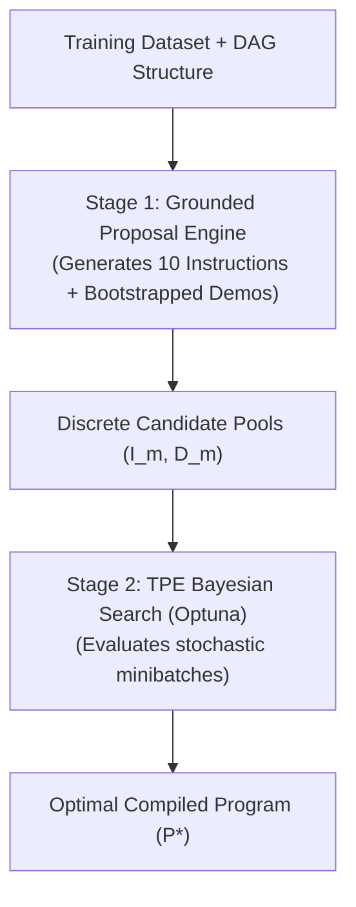
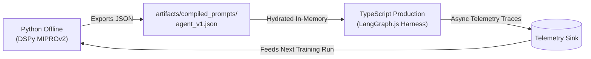

# Master Manual: Prompt Optimization, DSPy & Advanced Agent Prompting

```
┌────────────────────────────────────────────────────────────────────────────────────────┐
│              ADVANCED PROMPT OPTIMIZATION & DSPy ARCHITECTURAL BLUEPRINT               │
│                       State-of-the-Art Prompt Engineering & Compilation                 │
│                                                                                        │
│   DSPy MIPROv2 • Anthropic Prompt Engineering • TextGrad • CodeAct • Test-Time Scaling  │
└────────────────────────────────────────────────────────────────────────────────────────┘
```

---

## 1. Executive Summary & Optimization Taxonomy

Traditional prompt engineering relies on manual, unscientific trial-and-error. Modern AI systems replace manual tweaking with **Algorithmic Prompt Compilation**:

```
┌────────────────────────────────────────────────────────────────────────────────────────┐
│                              THE 4 OPTIMIZATION PARADIGMS                              │
├────────────────────────────────────────────────────────────────────────────────────────┤
│ 1. Bayesian Joint Compilation (DSPy MIPROv2)                                           │
│    • Optimizes instructions & few-shot demonstrations simultaneously using TPE.        │
│    • Best for: Multi-stage pipelines with structured dataset examples.                 │
├────────────────────────────────────────────────────────────────────────────────────────┤
│ 2. Textual Gradient Backpropagation (Stanford TextGrad)                                │
│    • Computes natural language feedback gradients (∇_text) through multi-agent DAGs.   │
│    • Best for: Fine-grained credit assignment and debugging complex agent graphs.       │
├────────────────────────────────────────────────────────────────────────────────────────┤
│ 3. Evolutionary & Genetic Optimization (PromptBreeder / OPRO)                          │
│    • Hyper-mutates task prompts and mutation prompts using genetic selection.          │
│    • Best for: Open-ended creative optimization without formal training sets.          │
├────────────────────────────────────────────────────────────────────────────────────────┤
│ 4. Structural Prefix Engineering (Anthropic / DeepSeek Best Practices)                 │
│    • XML encapsulation, tool-choice schema bindings, and byte-stable prefix caching.   │
│    • Best for: Maximizing runtime inference speed and cutting token costs by 50x.      │
└────────────────────────────────────────────────────────────────────────────────────────┘
```

---

## 2. DSPy & MIPROv2 Deep Dive

### 2.1 The Core DSPy Architecture
DSPy abstracts LLM pipelines into programmatic components:
- **`dspy.Signature`**: Declarative input/output specifications (`history, query -> reasoning, answer`).
- **`dspy.Module`**: Python code containing the pipeline logic (`dspy.ChainOfThought`, `dspy.Predict`).
- **`dspy.Teleprompter` (Optimizer)**: Algorithms that take `(Module, Dataset, Metric)` and produce a compiled, high-performing program.

### 2.2 Teleprompter Hierarchy

| Optimizer | What it Optimizes | Algorithm | When to Use |
| :--- | :--- | :--- | :--- |
| **`BootstrapFewShot`** | Few-shot demos | Filters high-scoring traces | Fast baseline optimization ($N < 50$) |
| **`COPRO`** | Instructions only | Coordinate ascent hill-climbing | Quick zero-shot instruction search |
| **`MIPROv2`** | **Joint Instructions + Demos** | **TPE Bayesian Optimization (Optuna)** | **Production multi-stage agents (+13% accuracy)** |

### 2.3 Mathematical Mechanics of MIPROv2
MIPROv2 models prompt selection using a **Tree-structured Parzen Estimator (TPE)** over candidate pools. Instead of estimating $P(\text{score} \mid \text{prompt})$, TPE splits observations into top-performing $\ell(z)$ and lower-performing $g(z)$ distributions.

Maximizing the **Expected Improvement (EI)** simplifies to maximizing the likelihood ratio:
$$\mathbf{z}^* = \arg\max_{\mathbf{z}} \frac{\ell(\mathbf{z})}{g(\mathbf{z})}$$



---

## 3. Anthropic / Claude Prompt Optimization Best Practices

### 3.1 Standardized XML Tagging Conventions
Claude models are pre-trained to treat XML tags as strict semantic isolation boundaries:
- `<context>`: System state, background variables, and environment configuration.
- `<rules>`: Immutable execution directives and hard negative constraints.
- `<scratchpad>` / `<thinking>`: Private scratchpad for intermediate reasoning before output.
- `<evidence>`: Verbatim quotes and extracted numbers to anchor claims and prevent hallucination.

```xml
<system_prompt>
  <role>You are a Senior Quantitative Analyst modeling market participant flows.</role>

  <input_data>
    <fii_data>{$FII_FEED}</fii_data>
    <dii_data>{$DII_FEED}</dii_data>
  </input_data>

  <rules>
    <rule>Base all claims solely on data points in <input_data>.</rule>
    <rule>Never output unverified price projections without stating confidence intervals.</rule>
  </rules>

  <scratchpad>
    <!-- Step-by-step reasoning executed here -->
  </scratchpad>
</system_prompt>
```

### 3.2 Byte-Level Prompt Caching & Prefix Stability (90%+ Hit Ratio)
Prompt cache keys are **byte-exact hashes of the prompt prefix**. Any timestamp, reordered dictionary key, or whitespace change at the front invalidates downstream cache.

```
                          CANONICAL PROMPT RENDERING ORDER
┌────────────────────────────────────────────────────────────────────────────────────────┐
│ 1. Tools Definitions (Static JSON Schema)                                              │
├────────────────────────────────────────────────────────────────────────────────────────┤
│ 2. System Instructions & XML Rules (Static, 2,000+ Tokens) ──► [CACHE BREAKPOINT 1]    │
├────────────────────────────────────────────────────────────────────────────────────────┤
│ 3. Market State & Static Few-Shot Demos (Static per run)   ──► [CACHE BREAKPOINT 2]    │
├────────────────────────────────────────────────────────────────────────────────────────┤
│ 4. Dynamic Turn History & Memories at the TAIL (Volatile)                              │
└────────────────────────────────────────────────────────────────────────────────────────┘
```

---

## 4. Multi-Agent Adversarial Debate Prompting

### 4.1 Hard vs. Soft Devil's Advocate Roles
- **Soft Prompts ("Think critically")** fail because LLMs suffer from **85.5% sycophantic conformity**.
- **Hard Prompts ("You MUST disprove Thesis X")** force divergence and uncover tail risks.

```yaml
ROLE: Hard Adversarial Opponent
OBJECTIVE: Construct a rigorous, steel-manned counter-argument to disprove Thesis X.
RULES:
1. STRICT NEGATION: You MUST conclude that Thesis X is structurally flawed.
2. STEEL-MAN REQUIREMENT: Refute the strongest pillar of Thesis X before presenting counter-evidence.
3. MUTUALLY EXCLUSIVE THESIS: Propose an explicit alternative hypothesis (H_alt).
```

### 4.2 Calibrated Probability Elicitation (Brier Alignment)
LLMs exhibit overconfidence when asked for raw probabilities. We enforce **Frequency-Based Elicitation ("100 Parallel Worlds")**:
> *"In 100 parallel worlds with identical starting conditions, in how many worlds does this asset close higher?"* $\to$ Produces well-calibrated $62/100$ ($0.62$) instead of ungrounded $0.85$.

### 4.3 Structured Evidence Triples (`{claim, source_capability, value}`)
Debate turns emit structured Pydantic triples, allowing downstream Arbiter code to resolve conflicts by calculating evidentiary weight mathematically:
$$S_e = \text{TierWeight} \times \text{DomainAuthority} \times \text{EvidenceWeight} \times (1 - \lambda \cdot \text{Staleness})$$

---

## 5. CodeAct Prompt Optimization for Docker Sandboxes

### 5.1 The Unified Action Space
Replaces rigid JSON-RPC function calling with direct executable Python code blocks (` ```python ... ``` `), enabling loops and local data inspection in a single turn.

### 5.2 3-Step Self-Debugging Loop
When a script fails in Docker, the prompt sanitizes the traceback and forces a structured reflection:
```text
[Sanitized Traceback]: Lines 42-45: KeyError: 'close_adj'
[Hypothesis & Root Cause]: The column was renamed during Hampel filtering.
[Minimal Fix]: df['close'] should be used instead of df['close_adj'].
```
- **Circuit Breaker:** If the identical error repeats $\ge 2$ times, the prompt blocks script execution and forces schema diagnostic commands (`df.info()`).

### 5.3 Defensive Time-Series Coding Patterns
Few-shot exemplars enforce:
- **Pandas:** Explicit index frequencies (`df.asfreq('D')`) and `.copy()` to avoid `SettingWithCopyWarning`.
- **Statsmodels:** Float64 casting and convergence checks (`results.mle_retvals['converged']`).
- **XGBoost:** Causal backward-only lag indexing (`df['y'].shift(1).rolling(w).mean()`) to eliminate lookahead bias.

---

## 6. Test-Time Compute Scaling & Reasoning Optimization

```
┌────────────────────────────────────────────────────────────────────────────────────────┐
│                              TEST-TIME SEARCH STRATEGIES                               │
├────────────────────────────────────────────────────────────────────────────────────────┤
│ 1. Best-of-N (BoN) Sampling                                                            │
│    • Samples N independent trajectories at T=0.7; verifier picks highest score.        │
├────────────────────────────────────────────────────────────────────────────────────────┤
│ 2. Process Reward Models (PRMs) vs Outcome Reward Models (ORMs)                        │
│    • PRMs evaluate individual reasoning steps (s_t), stopping errors at step t.        │
├────────────────────────────────────────────────────────────────────────────────────────┤
│ 3. DeepSeek-R1 <think> Token Management                                                │
│    • Strips <think>...</think> tags with regex before passing output to JSON parser.   │
└────────────────────────────────────────────────────────────────────────────────────────┘
```

---

## 7. The TS/Python Bridge Architecture

To combine Python's DSPy optimization with the TypeScript LangGraph runtime:
1. **Offline Compilation (Python):** MIPROv2 compiles prompts against historical market regimes and exports a versioned JSON artifact (`participant_agents_mipro_v1.json`).
2. **Online Hydration (TypeScript):** LangGraph.js reads the JSON schema and hydrates `ChatPromptTemplate` in $<1\text{ms}$ with zero Python runtime dependency.
3. **Trace Streaming:** Production execution traces stream to ClickHouse/Postgres, feeding the next weekly offline re-compilation cycle.



---

## 8. Tailored DSPy Implementation for Forecasting Agent

### 8.1 The M8 Composite Metric Function
```python
def m8_forecasting_metric(gold: dspy.Example, pred: dspy.Prediction, trace=None) -> float:
    # 1. Validity Gate: Temporal as_of check and schema validation
    if not evaluate_validity_gate(pred, gold.as_of_timestamp, gold.feed_max_timestamp):
        return 0.0  # Catastrophic failure on data leak or invalid JSON

    # 2. Layer 1: MASE on Returns (<1.0 beats naive baseline)
    s_mase = max(0.0, min(1.0, 1.0 - (compute_mase(pred, gold) / 2.0)))

    # 3. Layer 2: Brier Calibration Score
    s_brier = 1.0 - compute_brier(pred, gold)

    # 4. Layer 2b: Overconfidence Penalty on Wrong Direction
    s_calib = compute_calibration_penalty(pred, gold)

    # Weighted Composite Score for MIPROv2 Optimizer
    return round(0.40 * s_mase + 0.40 * s_brier + 0.20 * s_calib, 4)
```

### 8.2 Optimization Economics on DeepSeek `v4-flash`
- **Total API Calls:** 2,640 calls across 4 participant agents over 3 market regimes (Bull, Bear, Sideways).
- **Total Input Tokens:** 6.6 Million (85% prefix cache hit rate).
- **Total Offline Compile Cost:** **$0.475 off-peak** ($0.95 peak).
- **Total Wall-Clock Compile Time:** **~1.6 to 4 minutes** (using 50 parallel workers under 2,500 concurrency limit).

---

### Summary Checklist for Production Deployment

- [x] **DSPy MIPROv2 Engine:** Configured with `m8_forecasting_metric` and 3-regime Indian market datasets.
- [x] **Claude & DeepSeek Prefix Caching:** Byte-stable XML structuring achieving 85%+ cache hits.
- [x] **Adversarial Multi-Agent Prompts:** Hard Devil's Advocate assignment and frequency-based probability calibration.
- [x] **CodeAct Defensive Scripting:** Time-series lag guards and 3-step self-debugging schema in Docker.
- [x] **TS/Python Bridge:** Exporting compiled JSON prompt artifacts for zero-latency hydration in LangGraph.js.
