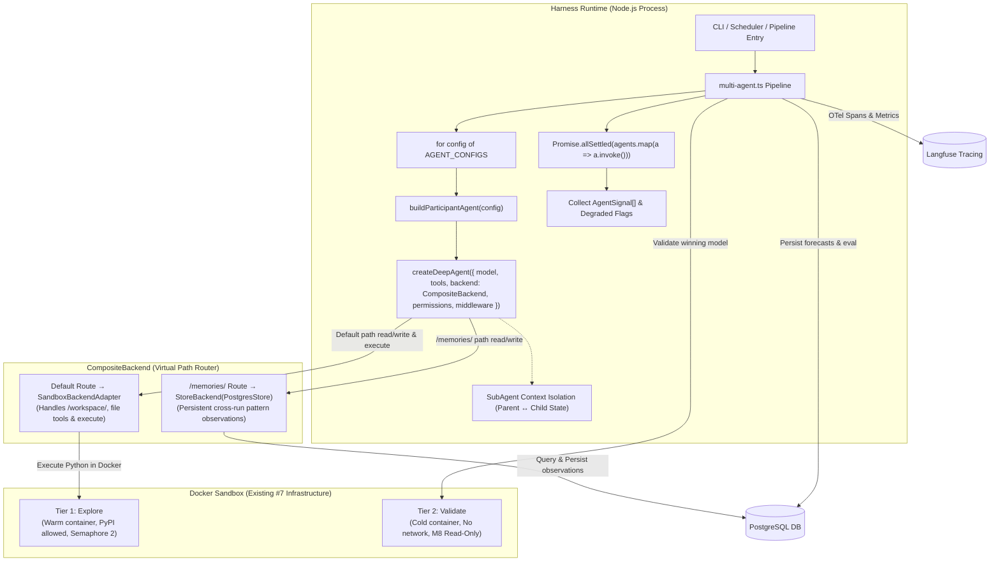

# Issue #10 Spec 1: Deep Agents Harness Generalization & Price Baseline Parity

## 1. Summary

Redesigns the agent instantiation layer in `Forecasting Agent` from a hardcoded single-agent script (`buildPriceAnchorAgent` in `single-agent.ts`) to a general, configuration-driven multi-agent harness leveraging the native capabilities of `deepagents@1.12.3` and `langchain@1.5.8`.

The architecture follows the in-process execution model used by production CLI agents (e.g., Claude Code, Codex CLI), using `deepagents`' subagent context isolation without external server daemons, a hybrid `CompositeBackend` routing Docker sandbox execution and PostgreSQL `StoreBackend` persistence, top-level `permissions: FilesystemPermission[]` path restrictions, a focused domain middleware stack, and Jinja2 (`nunjucks`) prompt templating.

**Spec 1 Scope**: Generalizes the harness plumbing, provides the generic `buildParticipantAgent(config)` factory, establishes `multi-agent.ts`, and verifies complete functional parity against the existing `price` agent baseline. The domain logic and prompt engineering for `fii`, `dii`, and `retail` agents will be developed in **Spec 2** against this proven foundation.

---

## 2. Architecture Overview



---

## 3. SubAgent Orchestration Model

### 3.1 In-Process Execution with Context Isolation

- **In-Process Topology**: All participant agents execute concurrently within the single Node.js harness process using `Promise.allSettled()`. No external agent servers, HTTP wrappers, or LangGraph Server daemons are required.
- **Context Isolation**: Each agent instantiated via `createDeepAgent()` maintains its own independent LangGraph execution state, tool history, and reasoning context window. Token accumulation in one agent does not pollute or inflate the context window of other agents.
- **Concurrency & Resource Throttling**: LLM reasoning turns run in parallel (up to DeepSeek rate limits handled by LLM Governor / Concurrency Governor). Docker code executions are strictly governed by the pre-existing `Semaphore(2)` in `SandboxManager`.

### 3.2 Dispatch and Aggregation Flow

```typescript
// harness/src/pipeline/multi-agent.ts
import { randomUUID } from 'node:crypto';
import { existsSync, unlinkSync, writeFileSync } from 'node:fs';
import { tmpdir } from 'node:os';
import { join } from 'node:path';
import type { Pool } from 'pg';
import { MultiServerMCPClient } from 'langchain-mcp-adapters';
import { PostgresStore } from '../storage/postgres-store.js';
import type { BaseStore } from '@langchain/langgraph-checkpoint';
import { AGENT_CONFIGS } from '../agents/types.js';
import { buildParticipantAgent } from '../agents/factory.js';
import { AgentSignalSchema, type AgentSignal } from '../agents/schema.js';
import { renderPrompt } from '../prompts/engine.js';
import { invokeAgentTurn } from './agent-turn.js';
import { buildAgentBackend } from '../backend/composite.js';
import { SandboxManager } from '../sandbox/manager.js';
import { SandboxBackendAdapter } from '../sandbox/deepagents-adapter.js';
import { ValidationFailedError } from '../sandbox/types.js';
import type { EvalResult as SandboxEvalResult } from '../sandbox/types.js';
import { saveForecast, saveAgentSignal, saveEvalResult } from '../storage/repository.js';
import { startForecastTrace, flushTraces, getLangchainCallbackHandler } from '../tracing/langfuse.js';
import { buildSearchTool } from '../search/tool.js';
import type { HarnessConfig } from '../config.js';
import type { SearchCapability, SearchRunLifecycle } from '../search/types.js';
import type { StructuredTool } from '@langchain/core/tools';
import type { AgentSignal as AgentSignalRow, EvalResult as EvalResultRow } from '../storage/types.js';
import type { TraceHandle } from '../tracing/langfuse.js';

export interface ParticipantExecutionResult {
  agentName: string;
  signal: AgentSignal | null;
  degraded: boolean;
  error?: string;
}

export interface RunMultiAgentPipelineParams {
  config: HarnessConfig;
  pool: Pool;
  symbol: string;
  search?: (SearchCapability & SearchRunLifecycle) | undefined;
  store?: BaseStore | undefined;
}

export interface RunMultiAgentPipelineResult {
  signals: Record<string, AgentSignal | null>;
  degradedAgents: string[];
  evalResult: SandboxEvalResult;
}

export async function dispatchParticipantAgents(params: {
  symbol: string;
  asOf: Date;
  tools: StructuredTool[];
  sandboxAdapter: SandboxBackendAdapter;
  store: BaseStore;
  llmConfig: HarnessConfig['llm'];
  trace: TraceHandle;
  langfuseHandler: any;
}): Promise<ParticipantExecutionResult[]> {
  const { symbol, asOf, tools, sandboxAdapter, store, llmConfig, trace, langfuseHandler } = params;

  const results = await Promise.allSettled(
    AGENT_CONFIGS.map(async (config) => {
      const prompt = renderPrompt(config, {
        symbol,
        as_of: asOf.toISOString().slice(0, 10),
        horizon_days: 1,
      });

      const backend = buildAgentBackend({
        sandboxAdapter,
        store,
        agentName: config.name,
      });

      const agent = buildParticipantAgent({
        config,
        llmConfig,
        tools,
        backend,
        trace,
      });

      const signal = await invokeAgentTurn<AgentSignal>({
        invoke: (invokeCfg) =>
          agent.invoke(
            { messages: [{ role: 'user', content: prompt }] },
            { ...invokeCfg, callbacks: [langfuseHandler] }
          ),
        schema: AgentSignalSchema,
        trace,
        turnId: `${config.name}-${symbol}`,
      });

      if (signal.agent_name !== config.name) {
        throw new Error(
          `Agent identity mismatch: configured agent is '${config.name}', but structured response returned '${signal.agent_name}'`
        );
      }

      return {
        agentName: config.name,
        signal,
        degraded: signal.degraded || false,
      };
    })
  );

  return results.map((res, i) => {
    if (res.status === 'fulfilled') {
      return res.value;
    }
    const config = AGENT_CONFIGS[i];
    return {
      agentName: config ? config.name : 'unknown',
      signal: null,
      degraded: true,
      error: res.reason instanceof Error ? res.reason.message : String(res.reason),
    };
  });
}

export async function runMultiAgentPipeline({
  config,
  pool,
  symbol,
  search,
  store,
}: RunMultiAgentPipelineParams): Promise<RunMultiAgentPipelineResult> {
  const runId = randomUUID();
  const asOf = new Date();
  const trace = startForecastTrace(config, runId, { symbol, asOf: asOf.toISOString() });
  const langfuseHandler = getLangchainCallbackHandler(config);

  return trace.runGrouped(
    {
      traceName: `multi_agent_forecast_run:${symbol}`,
      tags: [symbol, 'multi-agent'],
      ...(config.tracing.langfuse_session_id !== undefined && { sessionId: config.tracing.langfuse_session_id }),
    },
    () => runMultiAgentForecast({ config, pool, symbol, search, store, runId, asOf, trace, langfuseHandler }),
  );
}

async function runMultiAgentForecast({
  config,
  pool,
  symbol,
  search,
  store: externalStore,
  runId,
  asOf,
  trace,
  langfuseHandler,
}: RunMultiAgentPipelineParams & {
  runId: string;
  asOf: Date;
  trace: ReturnType<typeof startForecastTrace>;
  langfuseHandler: ReturnType<typeof getLangchainCallbackHandler>;
}): Promise<RunMultiAgentPipelineResult> {
  const serverName = config.capabilities.market_data;
  const mcpConfig = config.mcp_servers[serverName];
  if (!mcpConfig) {
    throw new Error(`MCP server configuration missing for capability 'market_data' (${serverName})`);
  }
  const mcpClient = new MultiServerMCPClient({ [serverName]: mcpConfig });
  const tools: StructuredTool[] = await mcpClient.getTools();

  let searchDegraded = false;
  let granted = 0;
  if (search) {
    granted = await search.beginRun(runId);
    const searchTool = buildSearchTool(
      {
        search: async (rId: string, q: string) => {
          const outcome = await search.search(rId, q);
          if (outcome.degraded) {
            searchDegraded = true;
          }
          return outcome;
        },
      },
      runId,
    );
    tools.push(searchTool);
  }

  const sandboxManager = new SandboxManager();
  const sandboxAdapter = new SandboxBackendAdapter(sandboxManager, runId);
  const store = externalStore ?? new PostgresStore({ pool });

  const signals: Record<string, AgentSignal | null> = {};
  const degradedAgents: string[] = [];

  try {
    const participantResults = await dispatchParticipantAgents({
      symbol,
      asOf,
      tools,
      sandboxAdapter,
      store,
      llmConfig: config.llm,
      trace,
      langfuseHandler,
    });

    for (const res of participantResults) {
      signals[res.agentName] = res.signal;
      if (res.degraded) {
        degradedAgents.push(res.agentName);
      }
    }

    const anchorConfig = AGENT_CONFIGS[0];
    if (!anchorConfig) {
      throw new Error('No agent configurations provided in AGENT_CONFIGS');
    }

    const anchorSignal = signals[anchorConfig.name];
    if (!anchorSignal) {
      throw new Error(`Anchor agent '${anchorConfig.name}' failed to produce a valid signal`);
    }

    let modelScriptPath = await writeModelScript(sandboxAdapter, anchorSignal, runId);
    let evalResult: SandboxEvalResult;

    try {
      const validateResult = await sandboxManager.runValidate({
        runId,
        tier: 'validate',
        modelScriptPath,
      });
      if (!validateResult.evalResult) {
        throw new Error('Validate tier returned no evalResult');
      }
      evalResult = validateResult.evalResult;
    } catch (err) {
      if (err instanceof ValidationFailedError) {
        throw err;
      }
      throw err;
    } finally {
      unlinkModelScript(modelScriptPath);
    }

    await saveForecast(pool, {
      symbol,
      horizon: `${anchorSignal.horizon_days}d`,
      prediction: anchorSignal,
      confidence: anchorSignal.confidence,
      as_of: asOf,
      degraded: searchDegraded || degradedAgents.includes(anchorConfig.name),
    });

    for (const [_, sig] of Object.entries(signals)) {
      if (sig) {
        await saveAgentSignal(pool, { signal: sig, as_of: asOf, forecast_run_id: runId });
      }
    }
    await saveEvalResult(pool, evalResult as unknown as EvalResultRow);

    trace.update({
      metadata: { symbol, runId, degradedAgents },
      output: { signals, verdict: evalResult.verdict },
    });

    return { signals, degradedAgents, evalResult };
  } finally {
    await sandboxAdapter.dispose();
    await mcpClient.close();
    if (search) {
      await search.endRun(runId);
    }
    trace.end();
    await flushTraces(config);
  }
}

async function writeModelScript(
  adapter: SandboxBackendAdapter,
  signal: AgentSignal,
  runId: string,
): Promise<string> {
  const path = join(tmpdir(), `model-${runId}.py`);
  const [downloaded] = await adapter.downloadFiles(['/workspace/model.py']);
  const scriptContent =
    downloaded?.content && !downloaded.error
      ? Buffer.from(downloaded.content).toString('utf8')
      : `# no /workspace/model.py found -- placeholder\nSIGNAL = ${JSON.stringify(signal)}\n`;
  writeFileSync(path, scriptContent);
  return path;
}

function unlinkModelScript(path: string): void {
  try {
    if (existsSync(path)) unlinkSync(path);
  } catch {}
}
```

---

## 4. Backend & Composite Storage Integration

### 4.1 Hybrid `CompositeBackend` Routing

`createDeepAgent()` accepts a single `backend` parameter conforming to `AnyBackendProtocol`:
```typescript
backend?: AnyBackendProtocol | ((config: { state: unknown; store?: BaseStore }) => AnyBackendProtocol)
```

`CompositeBackend` routes filesystem calls based on path prefixes:
1. **Default Route (`SandboxBackendAdapter`)**: All general paths (e.g. `/workspace/`, `/workspace/bars.json`, `/workspace/code/features/<agent_name>/model.py`) and command executions (`execute()`) route to the explore-tier Docker container via `SandboxBackendAdapter`. Per `deepagents`' `CompositeBackend.execute()`, shell execution delegates directly to the default backend.
2. **Persistent Route (`StoreBackend`)**: Paths prefixed with `/memories/` route to a `StoreBackend` backed by PostgreSQL (`BaseStore`). Cross-run pattern observations written to `/memories/<symbol>.json` are persisted across runs.

```typescript
// harness/src/backend/composite.ts
import { CompositeBackend, StoreBackend } from 'deepagents';
import type { BaseStore } from '@langchain/langgraph-checkpoint';
import type { SandboxBackendAdapter } from '../sandbox/deepagents-adapter.js';

export interface BuildAgentBackendParams {
  sandboxAdapter: SandboxBackendAdapter;
  store: BaseStore;
  agentName: string;
}

export function buildAgentBackend({
  sandboxAdapter,
  store,
  agentName,
}: BuildAgentBackendParams): CompositeBackend {
  return new CompositeBackend(
    sandboxAdapter, // Default backend: handles /workspace/* and execute()
    {
      '/memories/': new StoreBackend({
        store,
        namespace: ['memories', agentName],
      }),
    }
  );
}
```

### 4.2 Path Restrictions via `permissions`

Path boundaries are enforced using `deepagents`' native `permissions: FilesystemPermission[]` parameter. Rules are evaluated in declaration order with first-match semantics:

```typescript
// harness/src/backend/permissions.ts
import type { FilesystemPermission } from 'deepagents';

export function buildAgentPermissions(allowedWritePaths: string[]): FilesystemPermission[] {
  return [
    // 1. Explicitly allow writing to declared paths (workspace features + memory)
    {
      operations: ['write'],
      paths: allowedWritePaths,
      mode: 'allow',
    },
    // 2. Deny write operations everywhere else
    {
      operations: ['write'],
      paths: ['/**'],
      mode: 'deny',
    },
    // 3. Reads are permitted across the workspace and memory
    {
      operations: ['read'],
      paths: ['/**'],
      mode: 'allow',
    },
  ];
}
```

---

## 5. Middleware Architecture

### 5.1 Auto-Wired Middlewares

`deepagents`' internal `createAgent()` pipeline auto-wires:
1. `FilesystemMiddleware`: Exposes `read_file`, `write_file`, `edit_file`, `ls`, `glob`, `grep`, `execute` bound to `CompositeBackend`.
2. `SubAgentMiddleware`: Exposes subagent task delegation.
3. `SummarizationMiddleware`: Manages conversation history context compaction.
4. `PatchToolCallsMiddleware`: Fixes dangling tool calls or orphaned tool messages after interruptions.

### 5.2 Custom Domain Middlewares

Passed explicitly via `createDeepAgent({ middleware: [...] })`:

#### 1. `deepSeekAutoToolChoiceMiddleware` (Existing)
* **File**: `harness/src/llm/deepseek.ts`
* **Hook**: `wrapModelCall`
* **Purpose**: Forces `tool_choice: "auto"` to prevent HTTP 400 errors with DeepSeek thinking mode.

#### 2. `CostBudgetMiddleware` (Custom)
* **File**: `harness/src/middleware/cost-budget.ts`
* **Hook**: `wrapModelCall`
* **Purpose**: Tracks cumulative token consumption and aborts agent execution if it exceeds `maxTokenBudget` (default: 200,000 tokens).

```typescript
// harness/src/middleware/cost-budget.ts
import { createMiddleware } from 'langchain';
import type { UsageMetadata } from '@langchain/core/messages';

export function buildCostBudgetMiddleware(maxTokens: number) {
  let accumulatedTokens = 0;
  return createMiddleware({
    name: 'CostBudgetMiddleware',
    wrapModelCall: async (request, handler) => {
      if (accumulatedTokens >= maxTokens) {
        throw new Error(`Token budget exceeded: consumed ${accumulatedTokens} of ${maxTokens} max allowed tokens`);
      }
      const response = await handler(request);
      const usage = (response as unknown as { usage_metadata?: UsageMetadata }).usage_metadata;
      if (usage?.total_tokens) {
        accumulatedTokens += usage.total_tokens;
      }
      return response;
    },
  });
}
```

#### 3. `EvidenceValidationMiddleware` (Custom)
* **File**: `harness/src/middleware/evidence-validation.ts`
* **Hook**: `afterModel`
* **Purpose**: Audits `AgentSignal.evidence` to assert that `source_capability` aligns with the agent's declared allowed capabilities. If an unapproved capability is cited, it marks `degraded: true` on the structured response to protect scoring calibration integrity per ADR-023.

```typescript
// harness/src/middleware/evidence-validation.ts
import { createMiddleware } from 'langchain';
import type { AgentSignal } from '../agents/schema.js';

export function buildEvidenceValidationMiddleware(agentName: string, allowedCapabilities: string[]) {
  return createMiddleware({
    name: 'EvidenceValidationMiddleware',
    afterModel: async (state: { structuredResponse?: Record<string, unknown> }) => {
      if (!state.structuredResponse) return state;
      const signal = state.structuredResponse as Partial<AgentSignal>;
      if (Array.isArray(signal.evidence)) {
        let hasViolation = false;
        for (const item of signal.evidence) {
          if (!allowedCapabilities.includes(item.source_capability)) {
            console.warn(
              `[${agentName}] Evidence source_capability '${item.source_capability}' is outside allowed set: ${allowedCapabilities.join(', ')}. Marking signal degraded.`
            );
            hasViolation = true;
          }
        }
        if (hasViolation) {
          signal.degraded = true;
        }
      }
      return state;
    },
  });
}
```

#### 4. `AuditMiddleware` (Custom)
* **File**: `harness/src/middleware/audit.ts`
* **Hook**: `wrapModelCall`, `wrapToolCall`
* **Purpose**: Logs execution timings and tool latencies directly to the active Langfuse trace handle metadata.

```typescript
// harness/src/middleware/audit.ts
import { createMiddleware } from 'langchain';
import type { TraceHandle } from '../tracing/langfuse.js';

export function buildAuditMiddleware(agentName: string, trace?: TraceHandle) {
  return createMiddleware({
    name: 'AuditMiddleware',
    wrapModelCall: async (request, handler) => {
      const start = Date.now();
      try {
        return await handler(request);
      } finally {
        const durationMs = Date.now() - start;
        trace?.update({
          metadata: {
            [`${agentName}_last_model_duration_ms`]: durationMs,
          },
        });
      }
    },
    wrapToolCall: async (request, handler) => {
      const start = Date.now();
      try {
        return await handler(request);
      } finally {
        const durationMs = Date.now() - start;
        trace?.update({
          metadata: {
            [`${agentName}_tool_${request.toolCall.name}_duration_ms`]: durationMs,
          },
        });
      }
    },
  });
}
```

---

## 6. Participant Agent Configuration Schema

```typescript
// harness/src/agents/types.ts
import { z } from 'zod';

export const ParticipantAgentConfigSchema = z.object({
  name: z.enum(['price', 'fii', 'dii', 'retail']),
  roleTitle: z.string(),
  description: z.string(),
  promptTemplate: z.string(), // Relative path within harness/prompts/
  allowedCapabilities: z.array(z.string()),
  dataLaneDescription: z.string(),
  workspaceSubpath: z.string(), // e.g. "price" -> /workspace/code/features/price/
  allowedWritePaths: z.array(z.string()),
  tools: z.array(z.string()),
  skills: z.array(z.string()).default([]),
  maxTokenBudget: z.number().int().positive().default(200_000),
  horizon_days: z.literal(1),
  generatedBy: z.enum(['human', 'agent']).default('human'),
});

export type ParticipantAgentConfig = z.infer<typeof ParticipantAgentConfigSchema>;

export const AGENT_CONFIGS: ParticipantAgentConfig[] = [
  {
    name: 'price',
    roleTitle: 'Price Action & Macro Anchor',
    description: 'Analyzes target OHLCV, momentum indicators, moving averages, and sovereign macro drivers.',
    promptTemplate: 'price.j2',
    allowedCapabilities: ['market_data', 'macro'],
    dataLaneDescription: 'OHLCV bars + technical indicators + macro drivers (USDINR, Brent, US10Y)',
    workspaceSubpath: 'price',
    allowedWritePaths: [
      '/workspace/code/features/price/**',
      '/workspace/bars.json',
      '/workspace/model.py',
      '/memories/**',
    ],
    tools: ['fetch_ohlcv'],
    skills: [],
    maxTokenBudget: 200_000,
    horizon_days: 1,
    generatedBy: 'human',
  },
];
```

---

## 7. Wire Format: `AgentSignal` Schema

Conforms strictly to ADR-023, ADR-011 Layer 2 (Brier scoring input), and ADR-024 (Devil's Advocate selection input).

```typescript
// harness/src/agents/schema.ts
import { z } from 'zod';

export const EvidenceItemSchema = z.object({
  claim: z.string().min(1, 'Evidence claim cannot be empty'),
  source_capability: z.string().min(1, 'source_capability is required for auditability'),
  value: z.unknown(),
  explicit_absence: z.boolean().default(false), // true when indicator checked but no data exists
});

export type EvidenceItem = z.infer<typeof EvidenceItemSchema>;

export const AgentSignalSchema = z.object({
  agent_name: z.enum(['price', 'fii', 'dii', 'retail']),
  direction: z.enum(['up', 'down']), // Strict binary: returns > 0.0 is 'up', <= 0.0 is 'down'
  probability: z.number().min(0.0).max(1.0), // Calibration probability for Brier score
  confidence: z.number().min(0.0).max(1.0), // Conviction for calibration weighting
  horizon_days: z.literal(1), // Pinned to 1 until multi-horizon purging is supported
  evidence: z.array(EvidenceItemSchema).min(1, 'At least one evidence item is required'),
  dissent: z.string().optional(), // Devil's advocate counter-thesis (Round 3)
  degraded: z.boolean().default(false), // True if agent ran with partial data or degraded quota
});

export type AgentSignal = z.infer<typeof AgentSignalSchema>;
```

---

## 8. Cross-Run Pattern Memory System & PostgresStore

### 8.1 Data Model & PostgreSQL Table

Memories are stored in PostgreSQL using a dedicated `agent_memories` table (`005_agent_memories.sql`):
```sql
CREATE TABLE IF NOT EXISTS agent_memories (
  namespace text[] NOT NULL,
  key text NOT NULL,
  value jsonb NOT NULL,
  created_at timestamptz NOT NULL DEFAULT NOW(),
  updated_at timestamptz NOT NULL DEFAULT NOW(),
  PRIMARY KEY (namespace, key)
);
```

* **Namespace**: `['memories', agent_name]`
* **Key**: `${symbol}.json`
* **Payload**:
  ```json
  {
    "as_of": "2026-08-17",
    "observation": "RSI reached 78 (overbought) with volume 2.4x 20-day mean. Flat return followed over T+1.",
    "features_tested": ["rsi_14", "volume_zscore"],
    "direction_forecast": "down",
    "confidence": 0.85
  }
  ```

### 8.2 `PostgresStore` Implementation (`harness/src/storage/postgres-store.ts`)

Extends `@langchain/langgraph-checkpoint`'s `BaseStore` to provide persistent, multi-agent cross-run pattern storage backed by the existing `pg.Pool`:

```typescript
// harness/src/storage/postgres-store.ts
import type { Pool } from 'pg';
import { BaseStore } from '@langchain/langgraph-checkpoint';
import type {
  GetOperation,
  PutOperation,
  SearchOperation,
  ListNamespacesOperation,
  Item,
  SearchItem,
  Operation,
  OperationResults,
} from '@langchain/langgraph-checkpoint';

export interface PostgresStoreOptions {
  pool: Pool;
}

export class PostgresStore extends BaseStore {
  private pool: Pool;

  constructor(options: PostgresStoreOptions) {
    super();
    this.pool = options.pool;
  }

  async batch<Op extends Operation[]>(
    operations: Op
  ): Promise<OperationResults<Op>> {
    const results: unknown[] = [];

    for (const op of operations) {
      if ('key' in op && !('value' in op)) {
        const getOp = op as GetOperation;
        const res = await this.pool.query(
          `SELECT namespace, key, value, created_at, updated_at FROM agent_memories WHERE namespace = $1 AND key = $2`,
          [getOp.namespace, getOp.key]
        );
        if (res.rows.length === 0) {
          results.push(undefined);
        } else {
          const row = res.rows[0];
          results.push({
            namespace: row.namespace,
            key: row.key,
            value: row.value,
            createdAt: new Date(row.created_at),
            updatedAt: new Date(row.updated_at),
          });
        }
      } else if ('value' in op) {
        const putOp = op as PutOperation;
        if (putOp.value === null) {
          await this.pool.query(
            `DELETE FROM agent_memories WHERE namespace = $1 AND key = $2`,
            [putOp.namespace, putOp.key]
          );
        } else {
          await this.pool.query(
            `INSERT INTO agent_memories (namespace, key, value, created_at, updated_at)
             VALUES ($1, $2, $3, NOW(), NOW())
             ON CONFLICT (namespace, key)
             DO UPDATE SET value = EXCLUDED.value, updated_at = NOW()`,
            [putOp.namespace, putOp.key, JSON.stringify(putOp.value)]
          );
        }
        results.push(undefined);
      } else if ('namespacePrefix' in op) {
        const searchOp = op as SearchOperation;
        const res = await this.pool.query(
          `SELECT namespace, key, value, created_at, updated_at FROM agent_memories WHERE namespace[1:$1] = $2 LIMIT $3 OFFSET $4`,
          [
            searchOp.namespacePrefix.length,
            searchOp.namespacePrefix,
            searchOp.limit ?? 10,
            searchOp.offset ?? 0,
          ]
        );
        const items: SearchItem[] = res.rows.map((row) => ({
          namespace: row.namespace,
          key: row.key,
          value: row.value,
          createdAt: new Date(row.created_at),
          updatedAt: new Date(row.updated_at),
        }));
        results.push(items);
      } else if ('matchConditions' in op || 'maxDepth' in op) {
        const res = await this.pool.query(`SELECT DISTINCT namespace FROM agent_memories`);
        results.push(res.rows.map((r) => r.namespace));
      } else {
        results.push(undefined);
      }
    }

    return results as OperationResults<Op>;
  }
}
```

### 8.3 Lifecycle & Permissions Alignment

1. **Reading Past Patterns**: The agent uses standard `read_file('/memories/TCS.NS.json')`. `CompositeBackend` transparently routes the call to `StoreBackend.read('TCS.NS.json')`, which delegates to `PostgresStore.get(['memories', agent_name], 'TCS.NS.json')`.
2. **Writing New Observations**: The agent writes updated pattern notes using `write_file('/memories/TCS.NS.json', content)`, persisted to `agent_memories` via `PostgresStore.put(...)`.
3. **Permissions Safety**: Because `allowedWritePaths` includes `'/memories/**'`, `buildAgentPermissions` explicitly authorizes write operations to the `/memories/` route.

---

## 9. Prompt Template System

### 9.1 Layout & Initial Template

```
harness/prompts/
├── _macros.j2        # Shared JSON contracts (/tmp/eval_request.json specification)
└── price.j2          # Price action & macro baseline anchor prompt
```

### 9.2 Template Engine Implementation

```typescript
// harness/src/prompts/engine.ts
import nunjucks from 'nunjucks';
import { fileURLToPath } from 'node:url';
import { dirname, join } from 'node:path';
import type { ParticipantAgentConfig } from '../agents/types.js';

const __filename = fileURLToPath(import.meta.url);
const __dirname = dirname(__filename);
const PROMPTS_DIR = join(__dirname, '../../prompts');

const env = new nunjucks.Environment(new nunjucks.FileSystemLoader(PROMPTS_DIR), {
  autoescape: false,
  trimBlocks: true,
  lstripBlocks: true,
});

export interface PromptContext {
  symbol: string;
  as_of: string;
  horizon_days: number;
  [key: string]: unknown;
}

export function renderPrompt(config: ParticipantAgentConfig, context: PromptContext): string {
  return env.render(config.promptTemplate, {
    ...context,
    agent_name: config.name,
    role_title: config.roleTitle,
    data_lane_description: config.dataLaneDescription,
    workspace_path: `/workspace/code/features/${config.workspaceSubpath}/`,
  });
}
```

---

## 10. Agent Factory Implementation

```typescript
// harness/src/agents/factory.ts
import { createDeepAgent } from 'deepagents';
import { toolStrategy } from 'langchain';
import type { StructuredTool } from '@langchain/core/tools';
import { buildDeepSeekModel, deepSeekAutoToolChoiceMiddleware } from '../llm/deepseek.js';
import { buildCostBudgetMiddleware } from '../middleware/cost-budget.js';
import { buildEvidenceValidationMiddleware } from '../middleware/evidence-validation.js';
import { buildAuditMiddleware } from '../middleware/audit.js';
import { buildAgentPermissions } from '../backend/permissions.js';
import { AgentSignalSchema } from './schema.js';
import type { ParticipantAgentConfig } from './types.js';
import type { HarnessConfig } from '../config.js';
import type { CompositeBackend } from 'deepagents';
import type { TraceHandle } from '../tracing/langfuse.js';

export interface BuildParticipantAgentParams {
  config: ParticipantAgentConfig;
  llmConfig: HarnessConfig['llm'];
  tools: StructuredTool[];
  backend: CompositeBackend;
  trace?: TraceHandle;
}

export function buildParticipantAgent({
  config,
  llmConfig,
  tools,
  backend,
  trace,
}: BuildParticipantAgentParams) {
  const filteredTools = tools.filter((t) => config.tools.includes(t.name));

  return createDeepAgent({
    model: buildDeepSeekModel(llmConfig),
    tools: filteredTools,
    backend,
    permissions: buildAgentPermissions(config.allowedWritePaths),
    responseFormat: toolStrategy(AgentSignalSchema),
    middleware: [
      deepSeekAutoToolChoiceMiddleware,
      buildCostBudgetMiddleware(config.maxTokenBudget),
      buildEvidenceValidationMiddleware(config.name, config.allowedCapabilities),
      buildAuditMiddleware(config.name, trace),
    ],
  });
}
```

---

## 11. Migration & Parity Verification Plan

### 11.1 New & Modified Files

```
harness/
├── prompts/
│   ├── _macros.j2                       # [NEW] Shared prompt macros
│   └── price.j2                         # [NEW] Price agent Jinja2 template
├── src/
│   ├── agents/
│   │   ├── factory.ts                   # [NEW] Generic buildParticipantAgent factory
│   │   ├── schema.ts                    # [NEW] Canonical AgentSignal & EvidenceSchema
│   │   ├── types.ts                     # [NEW] ParticipantAgentConfig & AGENT_CONFIGS
│   │   └── price-anchor.ts              # [MODIFIED] Delegates to factory.ts for backward compatibility
│   ├── backend/
│   │   ├── composite.ts                 # [NEW] CompositeBackend storage router
│   │   └── permissions.ts               # [NEW] FilesystemPermission builder
│   ├── middleware/
│   │   ├── audit.ts                     # [NEW] AuditMiddleware
│   │   ├── cost-budget.ts               # [NEW] CostBudgetMiddleware
│   │   └── evidence-validation.ts       # [NEW] EvidenceValidationMiddleware
│   ├── prompts/
│   │   └── engine.ts                    # [NEW] Nunjucks prompt rendering engine
│   └── pipeline/
│       ├── multi-agent.ts               # [NEW] Generalized parallel execution pipeline
│       └── single-agent.ts              # [PRESERVED] Unmodified single-agent pipeline
```

### 11.2 8-Step Implementation Sequence

1. **Dependencies**: Add `nunjucks`, `@types/nunjucks`, `@langchain/langgraph-checkpoint`, and `@langchain/langgraph-checkpoint-postgres` to `harness/package.json`. Run `pnpm install`.
2. **Schemas**: Implement `harness/src/agents/schema.ts` (`AgentSignalSchema`) and `harness/src/agents/types.ts` (`ParticipantAgentConfigSchema`).
3. **Template Engine**: Implement `harness/src/prompts/engine.ts` and author `harness/prompts/price.j2`.
4. **Backend & Permissions**: Implement `harness/src/backend/composite.ts` (`CompositeBackend` builder) and `harness/src/backend/permissions.ts`.
5. **Middlewares**: Implement custom middlewares in `harness/src/middleware/`.
6. **Factory**: Implement `harness/src/agents/factory.ts`. Refactor `price-anchor.ts` to delegate to `factory.ts`.
7. **Pipeline**: Implement `harness/src/pipeline/multi-agent.ts`.
8. **Parity Verification**: Run baseline validation on `TCS.NS` across both `single-agent.ts` and `multi-agent.ts` with `AGENT_CONFIGS = [priceConfig]` to confirm identical execution behavior, `VALID` M8 evaluation verdict, and database persistence.

---

## 12. Verification & Testing Strategy

### 12.1 Unit Tests
* `test_schema_drift.ts`: Verifies that `AgentSignalSchema` matches evaluation scorer contracts (ADR-011 and ADR-023).
* `test_prompt_engine.ts`: Verifies that `price.j2` renders all required contracts (tool signatures, date ranges, `/tmp/eval_request.json` keys).
* `test_composite_backend.ts`: Verifies that writes to `/workspace/` route to `SandboxBackendAdapter` while writes to `/memories/` route to `StoreBackend`.
* `test_permissions.ts`: Asserts that `buildAgentPermissions` generates valid `FilesystemPermission[]` rules permitting declared paths (including `/memories/**`) and blocking unauthorized paths.
* `test_middlewares.ts`:
  - `CostBudgetMiddleware`: Asserts execution termination when tokens exceed budget.
  - `EvidenceValidationMiddleware`: Asserts that signals with unauthorized `source_capability` are flagged as `degraded: true`.
  - `AuditMiddleware`: Asserts timing metrics are properly emitted to Langfuse metadata.

### 12.2 Integration & Parity Verification
* Run `uv run pytest` to ensure Python backend tests continue passing.
* Run `pnpm test` in `harness/` to verify all 28 existing unit tests continue passing.
* **Comprehension Gate (Responsiveness Assertion)**: Vary the agent's output signal (e.g. direction 'up' vs 'down', probability 0.35 vs 0.82, and distinct evidence claims) across two test runs, and assert that both the persisted `AgentSignal` row in PostgreSQL and the payload handed to the evaluation scorer reflect the exact variation. This guarantees that signals are dynamically wired end-to-end and prevents static/hardcoded pass-through regressions.
* Execute a live run on `TCS.NS` using `multi-agent.ts` with `priceConfig` to confirm:
  1. `fetch_ohlcv` tool invocation succeeds.
  2. Python script is written to `/workspace/code/features/price/model.py`.
  3. Validate tier passes with `verdict == 'VALID'`.
  4. Structured `AgentSignal` is parsed, validated, and persisted.

---

## 13. Explicitly Deferred & Spec 2 Forward Notes

* **Spec 2 Participant Logic**: Implementation of `fii`, `dii`, and `retail` prompt templates (`fii.j2`, `dii.j2`, `retail.j2`) and their respective data lane configs in `AGENT_CONFIGS` (Spec 2).
* **Spec 2 Sandbox Isolation**: In Spec 1 (single agent `price`), one `SandboxBackendAdapter` container is used. For Spec 2 when all 4 agents run concurrently in `Promise.allSettled`, `SandboxManager` will allocate isolated sandbox sessions or partitioned workspace subpaths (`/workspace/code/features/<agent_name>/`) to prevent concurrent file overwrite collisions.
* **Skill Authoring**: Domain SKILL.md recipe authoring for `SkillsMiddleware` (post-Spec 2).
* **Multi-Day Purging**: Multi-day walk-forward horizons (`horizon_days > 1`).
* **Autonomous Generation**: Autonomous agent generation (`generatedBy: 'agent'`).
* **Factor Baseline**: Factor baseline ladder integration (#26).
* **Sentiment MCP**: News and FinBERT sentiment integration (#22).

---

## 14. Risks & Mitigations

| Risk | Severity | Mitigation |
| :--- | :--- | :--- |
| **DeepSeek Thinking Timeout** | Medium | `invokeAgentTurn` maintains an explicit 180s wall-clock timeout and `AGENT_RECURSION_LIMIT = 100`. |
| **Context Window Creep** | Low | `createDeepAgent`'s auto-wired `SummarizationMiddleware` automatically condenses history; `CostBudgetMiddleware` caps runaway turns. |
| **Parallel Execution Resource Contention** | Low | Docker code execution is throttled to 2 concurrent runs via `SandboxManager.Semaphore(2)`. |
| **Memory Isolation Across Agents** | High | `StoreBackend` namespaces are explicitly partitioned by `['memories', agentName]` and write permissions allow only `/memories/**`. |
